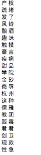
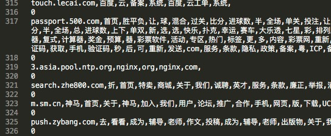
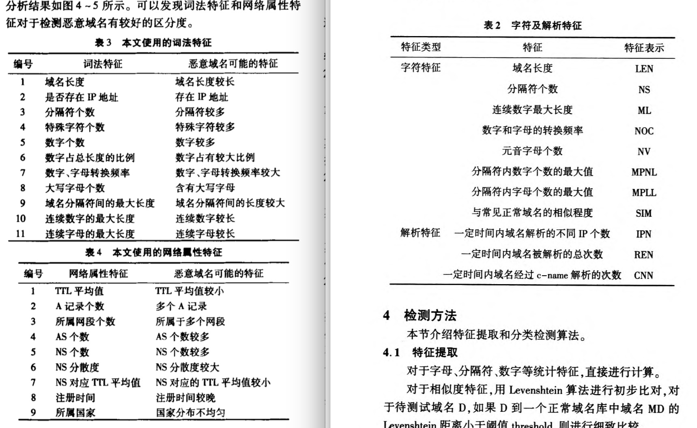

# DNSSecurity
The homework of DNS Security Course

### 数据源说明
---
1. 域名信息        
domain220w.txt 	1/2的原始数据  
domain300w.txt 	3/4的原始数据  
数据格式: 递归服务器IP，查询域名，请求类型，TTL，应答首个RR(resource record)类型，应答值(使用'；'分隔)，字段使用逗号分隔。 
数据爬取方式: 主动

2. Alexatop前100w访问域名         

| rank | domain |         
| ------ | ------|      
| 1 | google.com |        
| 2 | baidu.com  |         

 

### 解决思路
---

#### 1. 基于网页内容的判别方法

* 特征:       
	基于文本的特征:
	> \<head>\</head> \<title>\</title> \<a>\</a> \<table>\</table> \<li>\</li> \<ol>\</ol>       
	网页上合成图像的数量/非合成图像的数量/链接数量       

	特征降维:       
	基于Hash的方法[3]

* 现行主流分类方法:         
	线性分类器 - 感知器算法  
	非线性分类器 - SVM  
	统计分类器 - KNN             

* 基于文本内容识别赌博/色情网站         
	1. 通过爬虫爬取给定网站列表的内容, 并提取文本信息, 进行分词, 得到原始数据 (**这里管哥补充一下**)      
	2. 根据之前项目得到一个赌博/色情网站的常用关键词列表(见source/word.pick文件)     

	       

	3. 用脚本和人工的方法筛选出部分赌博/色情网站页面, 作为训练数据(url-词语列表-判别结果 source/word_x.txt)          
            
	            
            
	4. 特征提取           
	常见的提取文本特征的方法有one-hot和TF-IDF两种, 与将词频计算在内的TF-IDF方法相比, one-hot只考虑了词语的出现与否(本项目采用one-hot编码)           
	在我们的项目中已经生成关键词列表(设长度为n), 对于每一个网页生成一个长度为n的数组, 遍历其词语列表, 若与关键词列表中的项匹配, 则将该关键词对应的位置1        
	5. 模型建立       
	使用基于tensorflow的keras建立全连接神经网络, 其结构如下:

	            

	6. 模型训练           
	采用k折训练方法, 因为训练样本太少, k折验证可以提升小训练集在神经网络中的表达能力           

	7. 计算模型结果        
	根据上一步的模型训练结果对爬取到的网页数据进行判断, 并将分类结果写入结果文件(source/label.txt)

#### 2. 基于域名数据的判别方法          
           
* 核心思想(相较于基于网页内容的方法)                
	轻量级爬虫(避免干扰正常工作影响速度 nodejs异步)         
	无监督(不需要训练集)           
	基于页面以外的特征(不必下载页面)

* 主要方法     
	基于匹配的方法 - 黑名单(慢,不够灵活)        
	基于机器学习的方法 - 提取特征并训练判别      
	基于图的方法 - 可以用来发掘新的恶意域名(研究较少)     
	基于域名生成算法的方法 - 如DGA等(局限性比较大)     

* 特征选取        

	  

	上图是两篇论文中对域名数据特征的选择, 可以分为两个方面, 一方面是词法特征, 另一个方面是网络属性, 以下先对所有的属性进行汇总:       

	| 编号 | 域名词法特征 |  特征含义  |            
	| ------ | ------ | ------ |          
	| 1 | 域名长度 | 整个域名的长度(不含分隔符.) |          
	| 2 | 分割符个数 | .的个数(如www.taobao.com 为2) |           
	| 3 | 特殊字符个数 | 除了数字和字母以外的字符 |           
	| 4 | 数字占总长度的比例 | 数字个数与域名长度之比 |       
	| 5 | 分隔符内数字个数的最大值 | 两个.之间数字的最大个数 |        
	| 6 | 域名分隔符间的最大长度 | 两个.之间字符的最大个数 |         
	| 7 | 数字/字母转换频率 | 数字和字母两种字符切换的频率 |         

	| 编号 | 域名网络特征 |  特征含义  |          
	| ------ | ------ | ------ |          
	| 1 | TTL平均值 |  所有相同域名的TTL平均值 |         
	| 2 | 应答类型 | dns请求的应答类型 |         
	| 3 | 应答值个数 | 同一个域名被映射的IP地址个数 |           

	然后以基于网页内容的判别结果与白名单中的网站数据进行对比统计分析, 结果如下:        
	 

* 分类算法         
  随机森林分类器         

* 参考文献:       
	[1]黄凯,傅建明,黄坚伟, 等.一种基于字符及解析特征的恶意域名检测方法[J].计算机仿真,2018,35(3):287-292.       
	[2]张洋,柳厅文,沙泓州, 等.基于多元属性特征的恶意域名检测[J].计算机应用,2016,36(4):941-944,984. DOI:10.11772/j.issn.1001-9081.2016.04.0941.
	[3]CALA - An unsupervised URL-based web page classification system  
	[4]基于url特征检测的违法网站识别方法(基于HOST/PATH等信息) 

* 基本思路            
  1.无监督学习        
  通过上述特征提取的基本特征对待检测的域名进行聚类分析         
  
  2.监督学习       
  利用网页内容训练的结果集作为训练数据进行监督学习

#### 3. 准确率计算      
  爬取网页用更复杂的判断, 与现有的黑名单对比             
  准确率P, 召回率R, F1对结果进行评价 :             
  > P = TP / TP + FP              
    R = TP / TP + FN       
    F1 = 2PR / P + R          

如果分类器能够正确地检测出恶意域名，则TP=1;如 果分类器能够正确地检测出正常域名，则TN=1;如果分类 器不能正确地检测出恶意域名，则FP=1;如果分类器不能 正确地检测出正常域名，则=1。

### 文献方法
---
**1. Identifying Gambling and Porn Websites with Image Recognition**         
这篇文章里中用截图的方式对整个网页的内容进行抓取（截图的代码可以参考：https://blog.csdn.net/qiqiyingse/article/details/62896264）
然后使用SURF算法提取特征点（SURF算法：https://blog.csdn.net/tengfei461807914/article/details/79177897）
特征点聚类后建立BoW词袋模型（这是一个通过BoW搜索同类图像的代码：http://yongyuan.name/blog/CBIR-BoW-for-image-retrieval-and-practice.html）
最后用SVM(支持向量机)做监督学习

**2. An efficient scheme for automatic web pages categorization using the support vector machine(New Review of Hypermedia & Multimedia,2016)**         
首先对先前的分类方法进行了评估,提出在小训练集上svm的表现比贝叶斯好
然后提出在html5出现之后,之前的基于网页标签的特征提取需要进行改进，并提出了新的方法
最后用svm对网页进行分类,并做出评估

**3. LWCS: a large-scale web page classification system based on anchor graph hashing**          
文章介绍了LWCS这个大规模网页分类系统的组成和工作原理        
第一步是网页爬虫,使用heritrix这个基于Java的开源爬虫,改为数据库初始化,增加了筛选重复网页的过滤器,重写了工作队列          
第二步是对爬下来的原始数据去噪, 然后使用NLPIR将文本内容分割为短语       
第三步是特征选择,采用tf-idf方法(https://blog.csdn.net/allenshi_szl/article/details/6283375) 选择每个类别的前500个词语      
第四步是锚点图哈希, 用K均值聚类方法生成锚点, 以及最后的哈希码        
第五步是使用KNN分类器计算每个需要判别的网页与训练集中网页的相似度, 并把它归为相似度最大的一类       

**4. Building a Dynamic Reputation System for DNS**          
基于被动DNS信息搜集的DNS信誉评判系统, 可以生成一个动态的域名黑名单, 可检测出最新生成的恶意域名          
其数据来自美国两个州的骨干网DNS...
